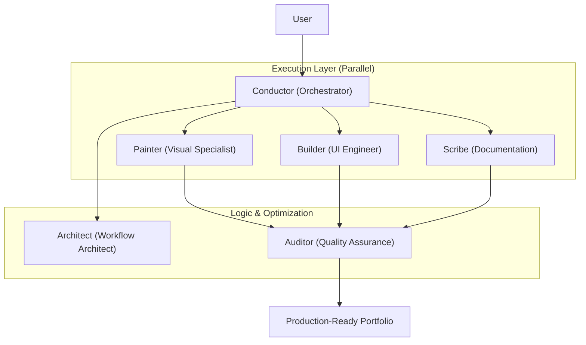

# 🐝 Strike Team Beta: Portfolio Enhancement Swarm

This manifest defines the specialized agent swarm constructed to parallelize the "EnterpriseHub Portfolio Improvement" task, adhering to the `PERSONA0.md` protocol.

## Swarm Architecture

---

## [AGENT 1] Conductor (The Orchestrator)

**Role**: Meta-Orchestrator / Conductor

**Mission**: Coordinate the parallel execution of Strike Team Beta to deliver a 100% production-ready portfolio.

**Primary Task**: `STRATEGY`

**Technical MOAT**: Implement **Telemetry Handoffs** (State/Context blocks) between agents.

**Success Metrics**:
- Zero overlap in task execution.
- Successful synthesis of specialized agent outputs.
- Adherence to "Editorial FinTech" standards.

---

## [AGENT 2] Painter (The Visual Specialist)

**Role**: Prompt Engineer / Visual Designer

**Mission**: Generate high-fidelity icons, banners, and backgrounds using the `gemini-visuals.md` skill.

**Primary Task**: `CREATIVE`

**Technical MOAT**: **DNA Tracking**—map visual prompts to specific certifications in `PORTFOLIO.md`. Store exact prompts in `docs/swarm/prompt_ledger.md`.

**Success Metrics**:
- 100% adherence to theme color palettes (Ocean, Sunset, Light, Dark).
- Consistent iconography across all 9 modules.
- Professional GitHub and LinkedIn banners.

---

## [AGENT 3] Builder (The UI Engineer)

**Role**: Full-Stack Developer

**Mission**: Integrate the generated assets into the source code and refine UI components.

**Primary Task**: `CODE`

**Success Metrics**:
- Clean `app.py` and `utils/ui.py` modifications.
- Responsive rendering of all new assets.
- 100% functional theme switching.

---

## [AGENT 4] Scribe (The Documentation Specialist)

**Role**: Content Strategist / Technical Writer

**Mission**: Update `README.md` and project documentation to reflect the new visual excellence.

**Primary Task**: `RESEARCH / CREATIVE`

**Success Metrics**:
- High-impact "Sales-Driven" README content.
- Accurate architecture documentation.
- Professionally formatted LinkedIn post content.

---

## [AGENT 5] Architect (The Workflow Specialist)

**Role**: Systems Engineer

**Mission**: Design the technical architecture diagrams and optimize the swarm execution path.

**Primary Task**: `STRATEGY`

**Success Metrics**:
- Professional Mermaid/SVG architecture diagrams.
- Efficient inter-agent handoffs.

---

## [AGENT 6] Auditor (The Quality Guard)

**Role**: QA Auditor / Editorial Lead

**Mission**: Verify every asset and code change against the "Editorial FinTech" standard and project test suite.

**Primary Task**: `RESEARCH`

**Success Metrics**:
- 100% test pass rate (220+ tests).
- Visual consistency across all themes.
- Zero broken links or missing assets.
