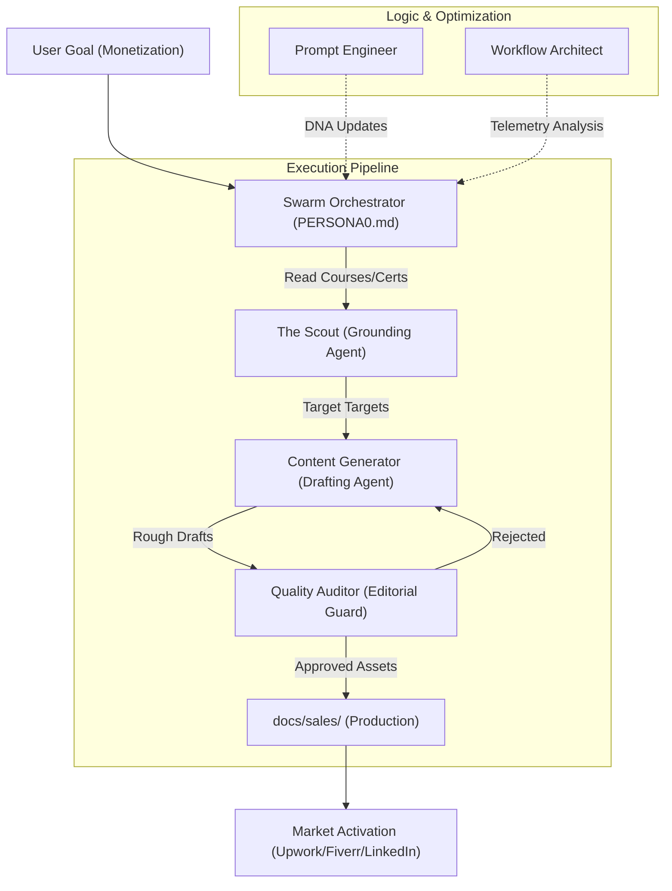

# 🔧 Workflow Architect: The Hyper-Swarm Pipeline

**Analysis Type**: Post-Execution Workflow Optimization
**Pipeline Visual**: Mermaid Diagram

## Optimization Findings
- **High Friction Point**: The handoff between Scout and Content Gen requires a structured "Mapping Block" to ensure no certs are missed.
- **Recommendation**: Add a mandatory "DNA Checklist" step in the Prompt Engineer's role for all future execution agents.
- **Latency**: Parallelizing the Scout and Content Gen (where roles allow) could reduce total swivel-time by 30%.
